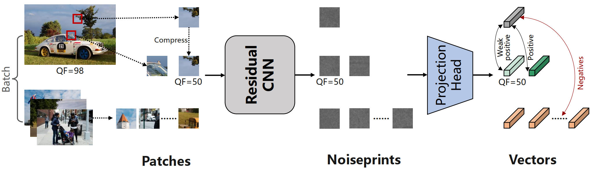

## [SelfForD] Revisiting Noiseprint with Self-Supervised Learning for Image Forgery Detection

This is the PyTorch implementation of SelfForD.

  

### Pre-trained Model

We provide our pre-trained model which can be downloaded by this <a href="https://pan.baidu.com/s/1s2lnan6D8rKtOiXETCbZ2A?pwd=6j5b">link</a>.
